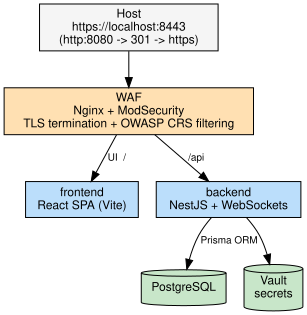
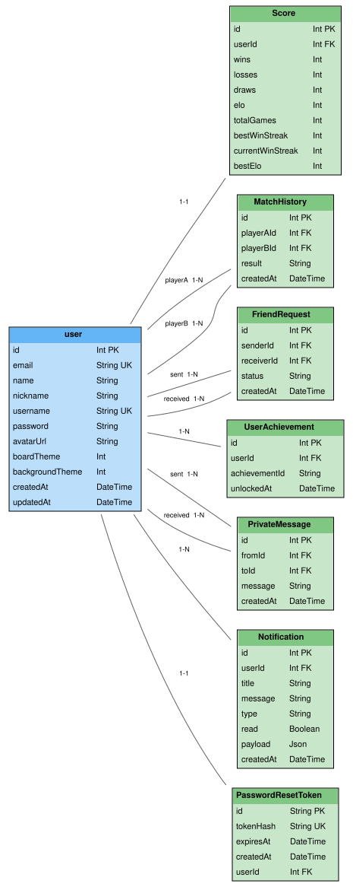

*This project has been created as part of the 42 curriculum by hbourlot, joralves, mfrancis, miafonso, ddiogo-f.*

# ft_transcendence

## Description


**ft_transcendence** is a full-stack, real-time multiplayer web application built as the final project of the 42 Common Core. It lets users play **chess** against other players, against an AI opponent (Stockfish), in real time, with matchmaking, live spectating, friends, private messaging, notifications, match history, and player statistics (ELO, win/loss/draw record, streaks).

Why chess instead of the subject's reference example (Pong)? One of the team members is a chess enthusiast and the team felt it offered a more interesting technical challenge.

Key features at a glance:
- Real-time multiplayer chess over WebSockets (Socket.IO)
- Matchmaking and direct/bot game modes- Friends system, private chat, and notifications 
- User profiles, avatars, match history, and ELO-based leaderboard. Players are placed into one of 5 rank tiers based on ELO: Rookie, Challenger, Master, Grandmaster, and Alumni.
- Timed games against a human opponent, a basic bot, or a Stockfish-powered AI with an adjustable difficulty slider.
- Secure infrastructure: HTTPS/TLS, WAF (ModSecurity via Nginx), secrets management (HashiCorp Vault)
- Fully containerized with Docker Compose
- Watch ongoing games live in spectator mode, with real-time board updates


## Instructions

### Prerequisites

- Docker and Docker Compose
- `openssl` (to generate strong secrets for `.env`)
- Node.js version v20.20.2 — only needed if you ever run frontend/backend outside Docker

### 1. Clone and configure secrets

Secrets are **never** committed to the repository. Copy the template and fill it with real values:

```bash
cp .env.example .env
```

Generate strong values — do not reuse the placeholders:

```bash
openssl rand -hex 32     # copy to JWT_SECRET
openssl rand -hex 32     # copy to VAULT_ROOT_TOKEN
openssl rand -hex 32     # copy to VAULT_BACKEND_TOKEN (least-privilege token the backend uses)
```

Required `.env` variables:

| Variable | Description |
|---|---|
| `POSTGRES_USER` | PostgreSQL username |
| `POSTGRES_PASSWORD` | PostgreSQL password — generate a strong one, don't reuse the example |
| `POSTGRES_DB` | PostgreSQL database name |
| `DATABASE_URL` | Full Prisma connection string, built from the three variables above |
| `BACKEND_PORT` | Port the NestJS backend listens on internally (`3000`) |
| `FRONTEND_PORT` | Port the Vite frontend listens on internally (`5173`) |
| `VITE_API_URL` | URL the frontend uses to reach the backend API |
| `NODE_ENV` | `development` or `production` |
| `JWT_SECRET` | Secret used to sign auth tokens (64-char hex) |
| `VAULT_ROOT_TOKEN` | Root token for HashiCorp Vault (used only by `vault-init`) |
| `VAULT_BACKEND_TOKEN` | Least-privilege token the backend uses to read its own secrets from Vault |
| `WAF_PORT` | Public HTTP port (redirects to HTTPS) — `8080` |
| `WAF_SSL_PORT` | Public HTTPS port — `8443` |

`.env` is git-ignored — keep it that way. An `.env.example` with safe placeholder values is committed instead.

### 2. Build and start the stack

```bash
make up        # or: docker compose up -d --build

```

Startup order is enforced by Compose:
1. `vault` starts and becomes healthy.
2. `vault-init` seeds the JWT and DB secrets into Vault, writes a read-only `backend-read` policy, and mints a least-privilege token for the backend — then exits.
3. `backend` boots **only after** `vault-init` succeeds, authenticating with the least-privilege token (not root) and fetching its secrets from Vault. It fails fast if Vault is unreachable.
4. `frontend` and the `waf` (Nginx + ModSecurity) come up last.

### 3. Access the app

Open **https://localhost:8443**. The certificate is self-signed, so accept the browser warning. Plain HTTP on `:8080` redirects (301) to HTTPS. Auth cookies are issued with the `Secure` attribute.

> Note: the **WAF is the only component exposed to the host** — the frontend, backend, and database have no published ports and are not directly reachable from outside the Docker network.

### 4. Useful commands

```bash
make down       # stop the stack
make generate   # prisma generate inside the backend container
make db-push    # apply the Prisma schema to the database
make logs       # follow logs
make safe       # rebuild + renew node_modules (keeps the DB volume), without tailing logs afterwards
```

Extra commands that came up during development (equivalent `docker exec` forms, useful when not going through `make`):

```bash
npx prisma generate                                          # regenerate the Prisma client after a schema change
docker restart chess_backend                                 # restart the backend container
docker exec -it chess_backend npm install @prisma/client     # (re)install/update the Prisma client inside the container
docker exec -it chess_database psql -U transcendence_admin -d transcendence_db   # open a psql shell (credentials in .env)
```

### 5. Verify the security controls

Smoke tests live in `scripts/`:

```bash
bash scripts/verify-tls.sh      # HTTPS 200, HTTP→HTTPS redirect, Secure cookie
bash scripts/verify-waf.sh      # SQLi / XSS / traversal / scanner requests are blocked (403)
bash scripts/verify-legal.sh    # legal pages served + input validation (400 on bad input)
```

## Architecture

The entire stack runs under Docker Compose on a private network. The **WAF is the only component exposed to the host** — the frontend, backend, and database are not directly reachable from outside.



- **Realtime** is handled over WebSockets (live moves, presence, chat, spectating).
- **Secrets** (JWT signing key, DB credentials) are seeded into **HashiCorp Vault** at startup; the backend fetches them from Vault and refuses to boot without them.
- **`vault-init`** is a one-shot job that seeds Vault before the backend starts.

## Resources

***Tech:***
- [Socket.IO documentation](https://socket.io/docs/v4/)
- [NestJS documentation](https://docs.nestjs.com/)
- [NestJS WebSocket Gateways](https://docs.nestjs.com/websockets/gateways)
- [Prisma documentation](https://www.prisma.io/docs)
- [React documentation](https://react.dev/)
- [chess.js](https://github.com/jhlywa/chess.js)
- [Stockfish](https://stockfishchess.org/)
- [Chess logic tutorial (N4JS)](https://eclipse.dev/n4js/userguides/n4js-tutorial-chess/n4js-tutorial-chess.html)
- [Chessboard.js](https://chessboardjs.com/index.html)
- [OWASP Core Rule Set](https://coreruleset.org/docs/)
- [ModSecurity CRS Docker image](https://github.com/coreruleset/modsecurity-crs-docker)
- [HashiCorp Vault documentation](https://developer.hashicorp.com/vault/docs)
- [OWASP Top 10](https://owasp.org/www-project-top-ten/)
- [Chess.com](https://www.chess.com/home)
- [Technologies](https://dev.to/itxnargis/chess-meets-code-how-i-created-a-full-stack-game-using-react-mongodb-2610)

### AI usage

**AI tools used:**
- Claude
- Gemini

**Used for:**
- Debugging and explaining errors (TypeScript/NestJS, WebSockets, infrastructure/WAF)
- Reviewing/explaining existing code during onboarding to the codebase
- Helping organize/structure code
- Detecting possible vulnerabilities
- UI/interface design decisions (layout, component consistency)
- Learning new technical concepts (ModSecurity/OWASP CRS, Vault)
- Drafting this README's structure and content

## Team Information

| Login | Role(s) | Responsibilities |
|---|---|---|
| miafonso | Product Owner + Developer | Account & social features — user profiles, friends system, and player progression (leaderboard, match history) |
| hbourlot | Project Manager + Developer | Frontend pages (Home, Signup, Play, Friends, Profile, History), matchmaking, chess game logic, AI opponent integration |
| joralves | Technical Lead + Developer | Real-time backend — WebSocket gateways for gameplay sync, chat, notifications, and presence; authentication |
| mfrancis | Developer — Cybersecurity | WAF/ModSecurity, HashiCorp Vault, HTTPS/TLS, server-side validation, and general application security hardening |
| ddiogo-f | Developer | Spectator mode — real-time live game browsing with a read-only board view; wrote and coordinated the final README |

## Project Management

- **Task distribution:** Feature-based branches, one person per module
- **Meetings/sync cadence:** Weekly online meetings — review what was done during the week, define new milestones, and set priorities
- **Project management tool(s):** GitHub Issues for task tracking; Fork (Git GUI client) for day-to-day Git usage
- **Communication channel(s):** WhatsApp and Discord
- **Git workflow:** feature branches , merged into `main`; small, testable, single-purpose commits.

## Technical Stack

| Layer | Technology |
|---|---|
| Frontend | React + TypeScript (Vite) |
| Backend | NestJS (Node.js) + WebSockets |
| ORM / Database | Prisma → PostgreSQL |
| Secrets | HashiCorp Vault |
| Edge / Security | Nginx + OWASP ModSecurity CRS (WAF), TLS/HTTPS |
| AI opponent | Stockfish engine |
| Orchestration | Docker + Docker Compose |

### Frontend
- **React** + **Vite**, **TypeScript**
- **Socket.IO** client for real-time communication
- **Tailwind CSS** for styling

### Backend
- **NestJS** (Node.js), **TypeScript**
- **Socket.IO** (WebSocket gateways) for real-time gameplay, presence, chat, and notifications
- **chess.js** for chess rules/validation
- **Stockfish** engine integration for the AI opponent
- **Prisma ORM**
- **DTO validation** (`class-validator`) on all `@Body` endpoints
- **Nodemailer** (via `@nestjs-modules/mailer`) for transactional emails (password reset)

### Database
- **PostgreSQL**, accessed via Prisma ORM.
- *Why PostgreSQL:* relational data (users, matches, friendships, achievements) fits a relational model naturally, and ACID guarantees matter for match history and stats. Using an ORM also satisfies the **Web — Minor: ORM** module.
- **Note on real-time data:** active/in-progress games are **not** stored in the database — they live in memory for performance, and are only stored once finished.

### Infrastructure & Security
- **Docker Compose** for containerized deployment; the **WAF is the only service exposed to the host** — frontend, backend, and database have no published ports.
- **HTTPS/TLS everywhere** via self-signed certificates; plain HTTP (`:8080`) 301-redirects to HTTPS (`:8443`); auth cookies use `Secure`.
- **WAF** — Nginx + OWASP ModSecurity CRS, blocking SQLi/XSS/path-traversal/scanner traffic.
- **HashiCorp Vault** for secrets management — the backend authenticates with a least-privilege, read-only token (never the root token) and fails to boot if Vault is unreachable.
- **Password hashing** — credentials stored as bcrypt hashes, never plaintext.


## Database Schema


| Model | Purpose | Key relationships |
|---|---|---|
| `user` | Player accounts (email, username, password, avatar, board/background theme preferences) | 1–1 with `Score`; 1–many with `MatchHistory` (as playerA/playerB), `FriendRequest` (sent/received), `UserAchievement`, `PrivateMessage` (sent/received), `Notification` |
| `Score` | Per-user statistics: wins, losses, draws, ELO, best ELO, total games, win streaks | 1–1 with `user` |
| `MatchHistory` | Record of a **finished** match (result, timestamp) | many–1 with `user` (playerA = white, playerB = black) |
| `FriendRequest` | Friend requests between users, with status (`PENDING`/`ACCEPTED`/`REJECTED`) | many–1 with `user` (sender/receiver); unique per sender-receiver pair |
| `UserAchievement` | Unlocked achievements per user | many–1 with `user`; unique per user-achievement pair |
| `PrivateMessage` | Direct messages between users | many–1 with `user` (from/to) |
| `Notification` | In-app notifications (title, message, type, read flag, optional JSON payload) | many–1 with `user` |
| `PasswordResetToken` | Short-lived, hashed token for the forgot-password flow | 1–1 with `user` (`onDelete: Cascade`) |

> ⚠️ **Note:** in-progress games are **not** represented in this schema by design — they exist only in server memory while active.

## Features List

| Feature | Description | Implemented by |
|---|---|---|
| Authentication | Signup/login, JWT-based auth | joralves |
| User profiles | Avatar, stats, match history | miafonso, joralves |
| Real-time chess gameplay | Move validation, turns, timers, draw/surrender | joralves, hbourlot |
| Matchmaking | Queue-based matching between players | joralves, hbourlot |
| AI opponent | Play against Stockfish | hbourlot |
| Friends system | Send/accept/reject friend requests | miafonso |
| Private chat | Direct messages between users | joralves |
| Notifications | Real-time in-app notifications | joralves |
| Leaderboard / ELO | Ranking based on match results | miafonso |
| Spectator mode | Browse and watch live games in real time without being able to move pieces | ddiogo-f |
| Frontend pages / UI | Home, Signup, Play, Friends, Profile, and History pages | hbourlot |
| WAF / request filtering | Nginx + ModSecurity (OWASP CRS) filters malicious traffic before it reaches the app | mfrancis |
| Secrets management | HashiCorp Vault stores and serves JWT signing key and DB credentials | mfrancis |
| HTTPS/TLS | TLS termination at the WAF; HTTP redirects to HTTPS | mfrancis |
| Server-side input validation | DTO-based validation on backend endpoints | mfrancis |
| Application security hardening | Centralized password policy, endpoint authorization checks, `Secure` session cookies | mfrancis |
| Legal pages | Privacy Policy and Terms of Service pages | mfrancis |
| Password recovery | Forgot-password email flow with a short-lived (15 min), hashed reset token | hbourlot |

## Modules

Overview table (details for each module below):

| Category | Module | Type | Points | Owner |
|---|---|---|---|---|
| Web | Framework for frontend and backend (React + NestJS) | Major | 2 | hbourlot |
| Web | Real-time features via WebSockets | Major | 2 | joralves |
| Web | ORM for the database (Prisma) | Minor | 1 | miafonso |
| Web | Notification system | Minor | 1 | joralves |
| User Management | Standard user management & authentication | Major | 2 | joralves |
| User Management | Game statistics and match history | Minor | 1 | miafonso |
| Artificial Intelligence | AI Opponent (Stockfish) | Major | 2 | hbourlot |
| Gaming and user experience | User interaction (chat + profile + friends system) | Minor | 1 | miafonso |
| Gaming and user experience | Complete web-based game (chess, real-time, live matches) | Major | 2 | hbourlot |
| Gaming and user experience | Remote players (latency handling, reconnection) | Major | 2 | joralves |
| Gaming and user experience | Game customization (pawn promotion) | Minor | 1 | hbourlot |
| Gaming and user experience | Spectator mode for games | Minor | 1 | ddiogo-f |
| Cybersecurity | WAF/ModSecurity + HashiCorp Vault | Major | 2 | mfrancis |
| **Total** | | | **20** | |

Minimum required: **14 points**. Points beyond 14 count as bonus, capped at **+5**.

---

### Web — Framework for frontend and backend (Major)
- **Justification:** React, NestJS, Tailwind CSS, and TypeScript were chosen to build a modern full-stack app.
- **Implementation:** the frontend was built with React + TypeScript, styled with Tailwind; the backend was built with NestJS + TypeScript, exposing modular APIs consumed by the frontend.

### Web — Real-time features via WebSockets (Major)
- **Justification:** enables real-time communication so the site feels more "alive" — used for chat and for remote play between players.
- **Implementation:** several WebSocket gateways were built (presence, game, notification, chat), each emitting and receiving events to update the frontend live — new messages, friend request notifications, or the chess board state after a page refresh.

### Web — ORM for the database (Minor)
- **Justification:** Using an ORM lets us work with objects instead of writing raw SQL, making data manipulation more readable and maintainable.
- **Implementation:** Prisma models are defined as objects mapped directly to database tables, so data is created and queried by manipulating objects rather than writing SQL queries by hand.

### Web — User interaction: chat + profile + friends system (Major)
- **Justification:** Essential for a competitive game played among friends — it gives players a way to interact with each other beyond just the match itself.
- **Implementation:** User records connect the database to the frontend with real-time updates. Friend requests are modeled with an explicit state (pending/accepted/rejected) per request. The private chat part of this module was implemented by joralves.

### Web — Notification system (Minor)
- **Justification:** an intuitive notification system, used for game invitations and friend requests, showing new information in real time.
- **Implementation:** backend gateways and controllers handle notification creation; the frontend has a notification bell that reacts to login or new events, showing the corresponding notification type and letting the user respond directly — e.g. redirecting to the friend hub, or accepting/rejecting a game invitation.

### User Management — Standard user management & authentication (Major)
- **Justification:** lets users have an account, making the game more competitive online and allowing personalized settings.
- **Implementation:** user records connect the database to the frontend; backend authentication uses JWTs stored as cookies to keep the session logged in; passwords are hashed with bcrypt (with salt) before storage, and bcrypt is used again to verify a password on login.

### User Management — Game statistics and match history (Minor)
- **Justification:** Gives players a timeline of their progress and account evolution over time.
- **Implementation:** After each match ends, the backend updates the player's stats in the database (wins/losses/draws, ELO, streaks) and records the match in the history table.

### Artificial Intelligence — AI Opponent, Stockfish (Major)
- **Justification:** lets users practice and improve even when no human opponent is available.
- **Implementation:** Stockfish was integrated into the NestJS backend, exposing dedicated API endpoints for AI moves.

### Gaming — Complete web-based game: chess (Major)
- **Justification:** the core project feature — lets users play full chess matches directly in the browser.
- **Implementation:** full chess gameplay was implemented, including playing with friends and a match system.

### Gaming — Remote players (Major)
- **Justification:** lets users on different machines play against each other, either in ranked or friendly games, giving the game more life.
- **Implementation:** built with WebSockets on top of the board logic — each valid move made on the frontend is emitted to the backend, which double-checks its validity and broadcasts the updated board state to the other player so they can make their move.

### Gaming — Game customization: pawn promotion (Minor)
- **Justification:** added to respect official chess rules.
- **Implementation:** a promotion flow triggers when a pawn reaches the last rank, letting the player choose the piece and synchronizing the choice for both players.

### Gaming — Spectator mode (Minor)
- **Justification:** the real-time infrastructure built for the core game already supported adding more participants to a live match, so extending it to read-only spectators gave the platform a social, "game room" feel at low extra cost.
- **Implementation:** spectators join the same real-time session as the players but in a read-only role, so they see the live board update without being able to move pieces. Active games only exist in memory while in progress, so no database changes were needed.

### Cybersecurity — WAF/ModSecurity + HashiCorp Vault (Major)
- **Justification:** the application handles real accounts and passwords, so we wanted all traffic filtered before it reached our code, and no secrets stored in the repository.
- **Implementation:** the WAF (Nginx + OWASP CRS) is the only entry point of the application and proxies to the frontend and backend, with some rules tuned to avoid false positives. TLS is terminated at the WAF and HTTP redirects to HTTPS. Vault stores the JWT key and database credentials, which the backend reads at startup using a read-only token.


## Individual Contributions

### miafonso
- Features/modules: **User interaction: chat + profile + friends system (Major)**: Implemented the friend request and profile. **Game statistics and match history (Minor)**: Implemented the leaderboard, game rank and the math history system
- Challenges faced and how they were overcome: Making the connection between the frontend, backend and data-base

### joralves
- Features/modules: Authentication, real-time chess gameplay sync, matchmaking, private/in-game chat, notifications, and profile updates (avatar/username/password/theme settings).
- Challenges faced and how they were overcome: the biggest challenge was understanding WebSockets and Socket.IO (which wraps native WebSockets) well enough to use it intuitively for real-time features.

### hbourlot
- Features/modules: Frontend pages (Home, Signup, Play, Friends, Profile, and History), matchmaking system, chess game logic, AI opponent (Stockfish) integration.
- Challenges faced and how they were overcome: the biggest challenge was ensuring a consistent layout across many screen sizes and resolutions. Solved by iteratively testing the interface on multiple viewport sizes, identifying layout breaks, and adjusting component structure to keep the UI stable on both desktop and smaller screens.

### mfrancis
- Features/modules: WAF (ModSecurity/OWASP CRS), HashiCorp Vault, HTTPS/TLS, server-side input validation, general application security hardening (password policy, endpoint authorization, secure cookies), and the legal pages.
- Challenges faced and how they were overcome: understanding the WAF. After adding it, the app started returning 403s on legitimate requests with nothing showing up in the backend logs. Reading ModSecurity's audit log to see exactly which rule was blocking each request solved it.

### ddiogo-f
- Features/modules: Spectator mode — users can browse live games and watch them update in real time, with a read-only board and a spectator-specific view of the game.
- Challenges faced and how they were overcome: misunderstood the existing game architecture at first, building a separate spectator route that created its own disconnected game instance instead of hooking into the real one. Fixed by sharing the existing game state instead of duplicating it.

## Known Limitations

- Using the browser's back/forward buttons to return to a previously viewed spectate page shows a stale board — it does not resume live updates. To watch a game live again, navigate to it fresh via the Live Games page.
- Performance on mobile is noticeably slower than on desktop.

## License / Credits

This project was developed as part of the 42 (Lisboa) Common Core curriculum and is not licensed for external use or distribution.
